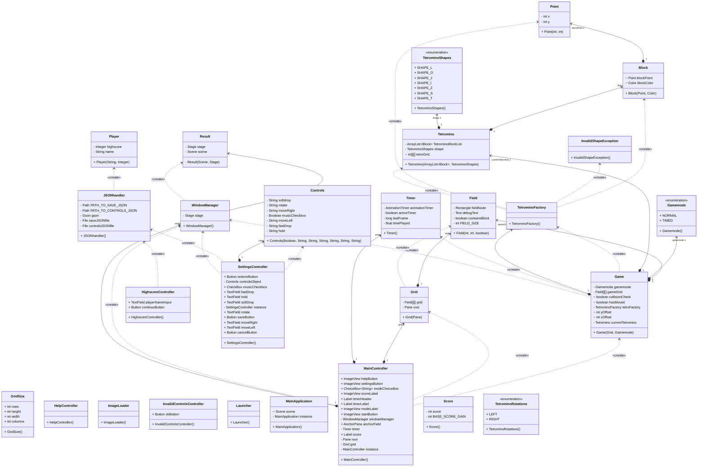
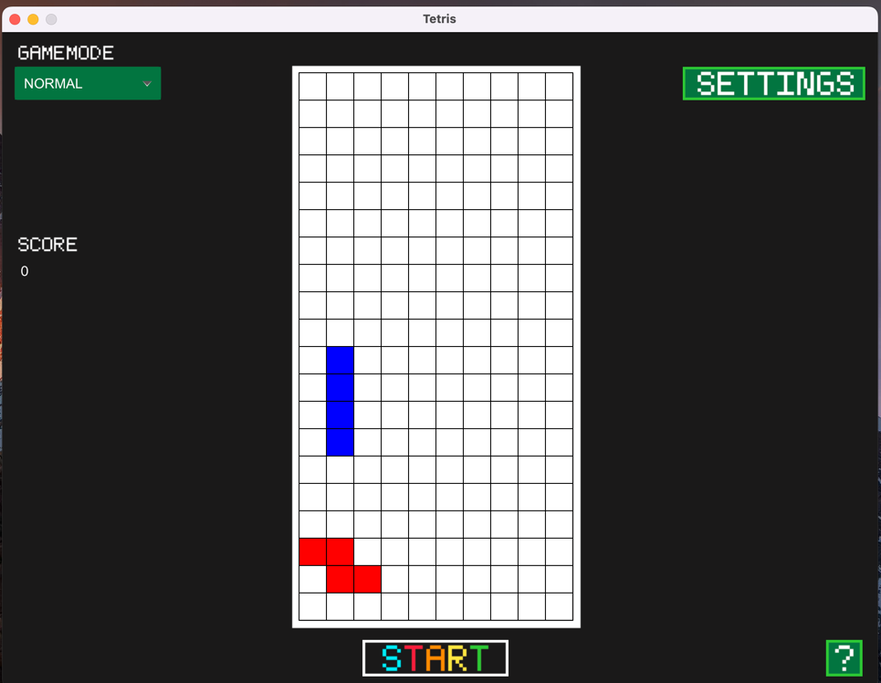
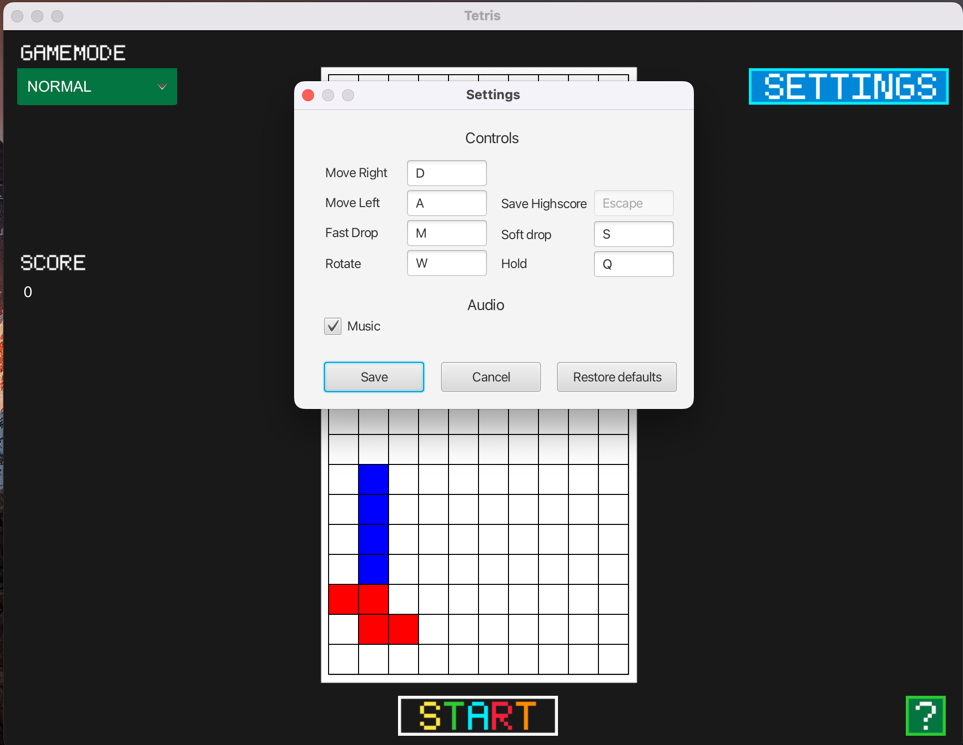
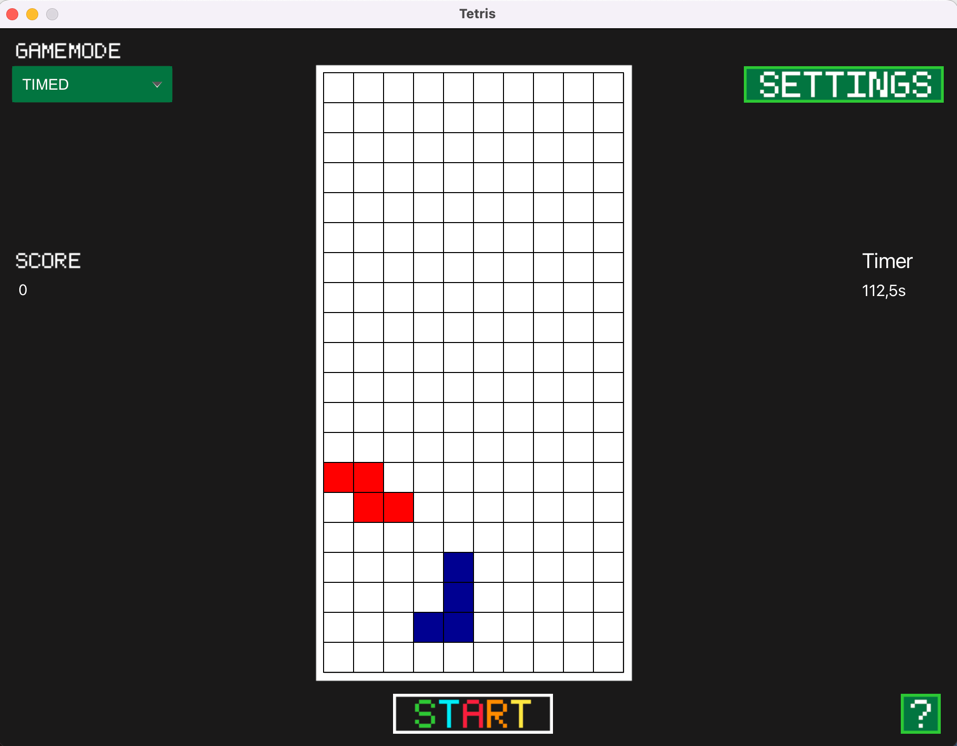

# Tetris

DISCLAIMER: This project is incomplete and has been archived.

Made by:
- Dino Kupinic
- Samed Karaman
- Max Wöss
- Johannes Rosenauer
- Jannick Angerer

---

### Features:
- 2 Gamemodes
- 8-bit pixel art UI
- Highscore
- Customizable Controls

How to run:
---
Navigate to \out\artifacts\Tetris_jar and double-click Tetris.jar.
You can also open it in an IDE.

### Class Diagram

---

### Preview images

